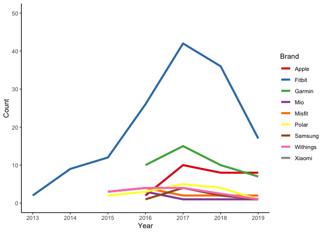
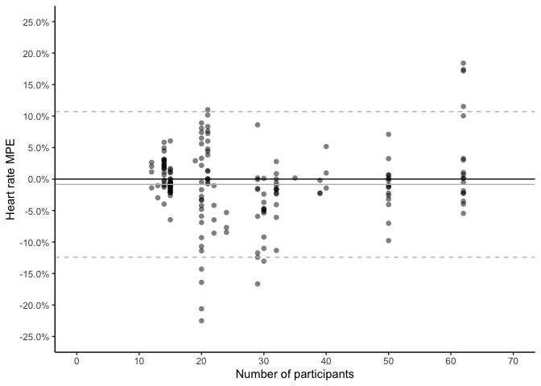
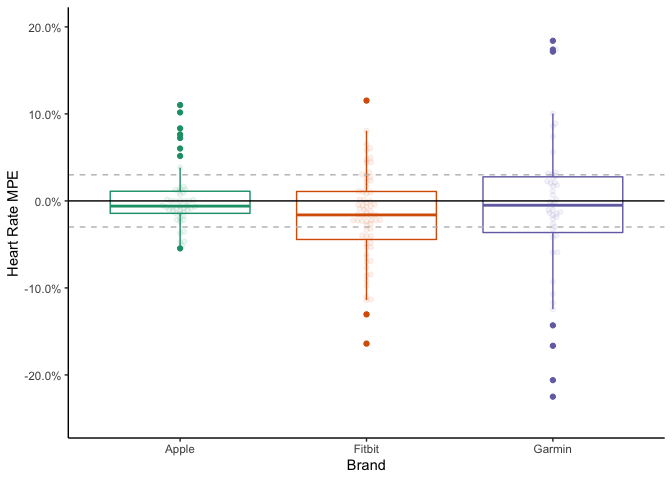
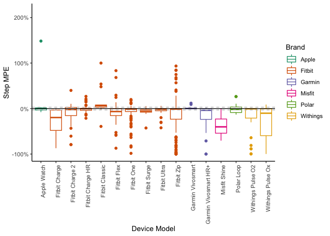
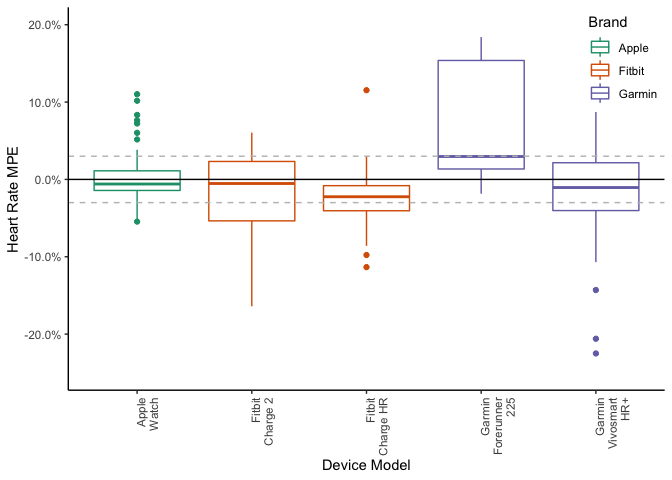
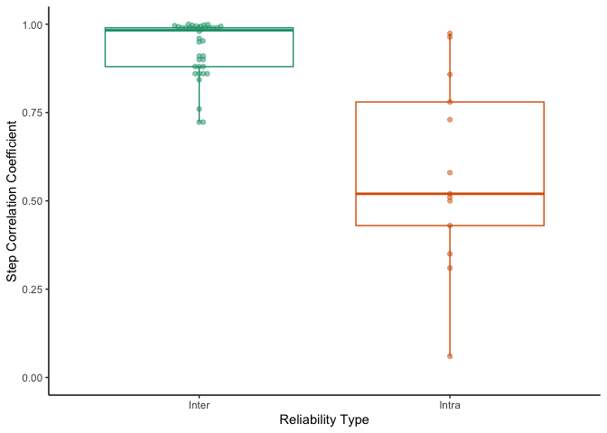

```r
# read in data
validity <- read_excel("SysReview_Results_all_20190819.xlsx", sheet = "validity_data")
```

```
## Warning in read_fun(path = enc2native(normalizePath(path)), sheet_i = sheet, :
## Expecting logical in CU1178 / R1178C99: got 'at least one tracker in approx 50%
## of subjects'
```

```r
#write.csv(validity, "/Users/dfuller/Dropbox/Projects/Device Review/SysReview_Results/wearable_review_data_validity.csv")

reliability <- read_excel("SysReview_Results_all_20190819.xlsx", sheet = "reliability_data")
#write.csv(reliability, "/Users/dfuller/Dropbox/Projects/Device Review/SysReview_Results/wearable_review_data_reliability.csv")

brandcountbyyear <- read_excel("SysReview_Results_all_20190819.xlsx", sheet = "study_brand")

study_measures <- read_excel("SysReview_Results_all_20190819.xlsx", sheet = "study_measures")
```

### Creating a Heart Rate yes no variable


```r
validity <- validity %>%
              mutate(hr_yes = case_when(
                device_name == "Apple Watch" ~ "hr",
                device_name == "Apple Watch Series 2" ~ "hr",
                device_name == "Blaze" ~ "hr",
                device_name == "Fitbit Charge 2" ~ "hr",
                device_name == "Fitbit Charge HR" ~ "hr",
                device_name == "Fitbit Surge" ~ "hr",
                device_name == "Garmin Fenix 3 HR" ~ "hr",
                device_name == "Garmin Forerunner 225" ~ "hr",
                device_name == "Garmin Forerunner 235" ~ "hr",
                device_name == "Garmin Vivosmart HR" ~ "hr",
                device_name == "Garmin Vivosmart HR+" ~ "hr",
                device_name == "Mio Alpha" ~ "hr",
                device_name == "Samsung Gear S" ~ "hr",
                device_name == "Samsung Gear S2" ~ "hr",
                device_name == "Samsung Gear S3" ~ "hr",
                device_name == "Withings Pulse O2" ~ "hr",
                device_name == "Withings Pulse Ox" ~ "hr",
                TRUE ~ "other"                
              ))

table(validity$device_name,  validity$hr_yes)
```

```
##                          
##                            hr other
##   Apple Watch             114     0
##   Apple Watch Series 2     17     0
##   Fitbit                    0     3
##   Fitbit Blaze              0    18
##   Fitbit Charge             0    34
##   Fitbit Charge 2          77     0
##   Fitbit Charge HR        166     0
##   Fitbit Classic            0    37
##   Fitbit Flex               0   137
##   Fitbit Force              0     6
##   Fitbit One                0   196
##   Fitbit Surge             37     0
##   Fitbit Ultra              0    49
##   Fitbit Zip                0   201
##   Garmin Fenix 3 HR         4     0
##   Garmin Forerunner 225    15     0
##   Garmin Forerunner 235    16     0
##   Garmin Forerunner 405CX   0     1
##   Garmin Forerunner 735XT   0     3
##   Garmin Forerunner 920XT   0    11
##   Garmin Vivoactive         0     6
##   Garmin Vivofit            0   111
##   Garmin Vivofit 2          0    11
##   Garmin Vivofit 3          0     6
##   Garmin Vivosmart          0    14
##   Garmin Vivosmart HR      24     0
##   Garmin Vivosmart HR+     60     0
##   Mio Alpha                14     0
##   Mio Fuse                  0     7
##   Misfit Flash              0     6
##   Misfit Shine              0    44
##   Polar A300                0     2
##   Polar A360                0    16
##   Polar Active              0     6
##   Polar Loop                0    34
##   Polar M600                0     1
##   Polar V800                0     8
##   Samsung Gear 2            0     4
##   Samsung Gear S            9     0
##   Samsung Gear S2           3     0
##   Samsung Gear S3           3     0
##   Withings Pulse O2        88     0
##   Withings Pulse Ox        46     0
##   Xiaomi Mi Band            0     2
##   Xiaomi Mi Band 2          0     5
```

# Figure 1: PRISMA Flow Chart
> Flow chart is available as a word document on Dropbox

# Figure 2: Count of Studies per Measure by Publishing Year

```r
studies_time_measure <- ggplot(study_measures, aes(Year)) +
                    geom_bar(aes(fill = Measure), position=position_dodge()) + 
                    scale_y_continuous(name = "Count", breaks=seq(0,40,10),limits=c(0, 40)) +
                    scale_x_continuous(breaks=seq(2013,2019,1)) +
                    #scale_fill_grey() +
                    theme_classic()
plot(studies_time_measure)
```

<!-- -->

```r
ggsave("studies_time_measure.pdf", plot = studies_time_measure, width = 6, height = 4)
```

# Figure 3: Count of Studies per Brand by Publishing Year

```r
brand_count_year <- brandcountbyyear %>%
      group_by(Year, Brand) %>%
        summarize(
          count = n()
        )

brand_count_year
```

```
## # A tibble: 38 x 3
## # Groups:   Year [7]
##     Year Brand    count
##    <dbl> <chr>    <int>
##  1  2013 Fitbit       2
##  2  2014 Fitbit       9
##  3  2015 Fitbit      12
##  4  2015 Misfit       3
##  5  2015 Polar        2
##  6  2015 Withings     3
##  7  2016 Apple        2
##  8  2016 Fitbit      26
##  9  2016 Garmin      10
## 10  2016 Mio          3
## # … with 28 more rows
```

```r
studies_time_brand <- ggplot(brand_count_year, aes(x = Year, y = count, colour = Brand)) +
                    geom_line(size=1.5) + 
                    scale_fill_brewer(palette = "Pastel1") +
                    scale_y_continuous(name = "Count", breaks=seq(0,500,10),limits=c(0, 50)) +
                    scale_x_continuous(breaks=seq(2013,2019,1)) +
                    scale_colour_brewer(palette="Set1") +
                    theme_classic()
plot(studies_time_brand)
```

<!-- -->

```r
ggsave("studies_time_brand.pdf", plot = studies_time_brand, width = 6, height = 4)
```

# Filtering data for plotting


```r
# Filter MPE to remove NAs
validity_mpe <- filter(validity, !is.na(validity$MPE))

# Filter MPE into data frames by measure type
validity_mpe_ee <- filter(validity_mpe, Measured == "EE")
validity_mpe_sc_unfilter <- filter(validity_mpe, Measured == "SC")
validity_mpe_hr <- filter(validity_mpe, Measured == "HR")

# Filter MPE by collection setting

validity_mpe_sc_control <- filter(validity_mpe_sc_unfilter, Setting == "Controlled")
validity_mpe_ee_control <- filter(validity_mpe_ee, Setting == "Controlled")
validity_mpe_hr_control <- filter(validity_mpe_hr, Setting == "Controlled")
validity_mpe_sc_free <- filter(validity_mpe_sc_unfilter, Setting == "Free-Living")
validity_mpe_ee_free <- filter(validity_mpe_ee, Setting == "Free-Living")
validity_mpe_hr_free <- filter(validity_mpe_hr, Setting == "Free-Living")
```

# Figure 4: MPE Plots by n analyzed, Controlled Setting
Percentage error distribution by sample size in controlled settings for each measure
* Solid blue lines indicate mean error 
* Dashed blue lines indicate 95% CI

## Figure 4a: MPE Plot by n analyzed for Step Count, Controlled Setting


```r
mpe_n_plot_sc <- ggplot(validity_mpe_sc_unfilter, aes(x = actual_n_analyzed, y = MPE)) +
                    geom_point(shape = 16, alpha = 0.5, size = 2) +
                    scale_y_continuous(breaks = seq(-2, 6, 1), limits = c(-1, 6), labels=percent) +
                    geom_hline(yintercept = 0) +
                    geom_hline(yintercept = mean(validity_mpe_sc_control$MPE), colour = "grey") +
                    geom_hline(yintercept = (mean(validity_mpe_sc_control$MPE) + 
                                               1.96*sd(validity_mpe_sc_control$MPE)), 
                                              linetype = "dashed", colour = "grey", size = 0.5) +
                    geom_hline(yintercept = (mean(validity_mpe_sc_control$MPE) - 
                                               1.96*sd(validity_mpe_sc_control$MPE)), 
                                                linetype = "dashed", colour = "grey", size = 0.5) +
                    scale_x_continuous(breaks = seq(0, 180, 30), limits = c(0, 180)) +
                    theme_classic() +
                    theme(plot.title = element_text(hjust = 0.5)) +
                    xlab("# of Participants") +
                    ylab("Step MPE") +
                    annotate("rect", xmin = 35, xmax = 45, ymin = 1.00, ymax = 5.5, alpha = .2) + 
                    annotate("text", x = 55, y = 3.5, label = "outliers") 
plot(mpe_n_plot_sc)
```

```
## Warning: Removed 2 rows containing missing values (geom_point).
```

<!-- -->

```r
ggsave("4a_mpe_n_plot_sc.pdf", plot = mpe_n_plot_sc, width = 6, height = 4)
```

```
## Warning: Removed 2 rows containing missing values (geom_point).
```

## Figure 4b: MPE Plot by n analyzed for Heart Rate, Controlled Setting


```r
mpe_n_plot_hr <- ggplot(validity_mpe_hr, aes(x = actual_n_analyzed, y = MPE)) +
                    geom_point(shape = 16, alpha = 0.5, size = 2) +
                    scale_y_continuous(breaks = seq(-0.25,0.25,0.05), limits=c(-0.25, 0.25), labels = percent) +
                    geom_hline(yintercept = 0) +
                    geom_hline(yintercept = mean(validity_mpe_hr_control$MPE), colour = "grey") +
                    geom_hline(yintercept = (mean(validity_mpe_hr_control$MPE) + 1.96*sd(validity_mpe_hr_control$MPE)), linetype = "dashed", colour = "grey", size = 0.5) +
                    geom_hline(yintercept = (mean(validity_mpe_hr_control$MPE) - 1.96*sd(validity_mpe_hr_control$MPE)), linetype = "dashed", colour = "grey", size = 0.5) +
                    scale_x_continuous(breaks = seq(0, 70, 10), limits = c(0, 70)) +
                    theme_classic() +
                    theme(plot.title = element_text(hjust = 0.5)) +
                    xlab("# of Participants") +
                    ylab("Heart Rate MPE") 
plot(mpe_n_plot_hr)
```

<!-- -->

```r
ggsave("4b_mpe_n_plot_hr.pdf", plot = mpe_n_plot_hr, width = 6, height = 4)
```

## Figure 4c: MPE Plot by n analyzed for Energy Expenditure, Controlled Setting


```r
mpe_n_plot_ee <- ggplot(validity_mpe_ee, aes(x = actual_n_analyzed, y = MPE)) +
                    geom_point(shape = 16, alpha = 0.5, size = 2) +
                    scale_y_continuous(breaks = seq(-1,2.5,0.5),limits=c(-1, 2.5), labels = percent) +
                    geom_hline(yintercept = 0) +
                    geom_hline(yintercept = mean(validity_mpe_ee_control$MPE), colour = "grey", size = 0.5,) +
                    geom_hline(yintercept = (mean(validity_mpe_ee_control$MPE) + 1.96*sd(validity_mpe_ee_control$MPE)), linetype = "dashed", colour = "grey", size = 0.5) +
                    geom_hline(yintercept = (mean(validity_mpe_ee_control$MPE) - 1.96*sd(validity_mpe_ee_control$MPE)), linetype = "dashed", colour = "grey", size = 0.5) +
                    scale_x_continuous(breaks = seq(0, 120, 30), limits = c(0, 120)) +
                    theme_classic() +
                    theme(plot.title = element_text(hjust = 0.5)) +
                    xlab("# of Participants") +
                    ylab("Energy Expenditure MPE") +
                    annotate("rect", xmin = 30, xmax = 64, ymin = 1.30, ymax = 2.2, alpha = .2) + 
                    annotate("text", x = 46, y = 1.7, label = "outliers") 
plot(mpe_n_plot_ee)
```

<!-- -->

```r
ggsave("4c_mpe_n_plot_ee.pdf", plot = mpe_n_plot_ee, width = 6, height = 4)
```

# Figure 4 


```r
figure4 <- plot_grid(mpe_n_plot_sc, mpe_n_plot_hr, mpe_n_plot_ee, labels = c('A', 'B', 'C'), label_size = 12)
```

```
## Warning: Removed 2 rows containing missing values (geom_point).
```

```r
plot(figure4)
```

<!-- -->

```r
ggsave("figure4.pdf", plot = figure4, width = 8.5, height = 6)
```


# Figure 5a: MPE Plot for Step Count, Controlled Setting, by Brand

Filter data by brands with <10 comparisons

```r
validity_mpe_sc_brandfilter_control <- filter(validity_mpe_sc_control, Brand != "Mio", Brand != "Xiaomi")

mpe_plot_sc_brandfilter_control <- ggplot(validity_mpe_sc_brandfilter_control, aes(x = Brand, y = MPE, colour = Brand)) +
                    geom_boxplot() +
                    geom_beeswarm(dodge.width = 0.2, cex = 0.2, alpha = 0.08) +   
                    geom_hline(yintercept = 0) +  
                    geom_hline(yintercept = 0.03, size = 0.5, colour = "grey", linetype = "dashed") + 
                    geom_hline(yintercept = -0.03, size = 0.5, colour = "grey", linetype = "dashed") +   
                    scale_y_continuous(limits=c(-1, 1),labels = percent) +
                    theme_classic() +
                    ylab("Step MPE") +
                    scale_colour_brewer(palette="Dark2") +
                    theme(legend.position = "none")
plot(mpe_plot_sc_brandfilter_control)
```

```
## Warning: Removed 4 rows containing non-finite values (stat_boxplot).
```

```
## Warning: Removed 4 rows containing missing values (position_beeswarm).
```

<!-- -->

```r
ggsave("5a_mpe_plot_sc_brandfilter_control.pdf", plot = mpe_plot_sc_brandfilter_control, width = 6, height = 4)
```

```
## Warning: Removed 4 rows containing non-finite values (stat_boxplot).

## Warning: Removed 4 rows containing missing values (position_beeswarm).
```

# Figure 5b: MPE Plot for HR by Brand, Controlled Setting
* Solid grey lines indicate ± 3% measurement error


```r
# Filter Heart Rate MPE to remove brands with < 10 comparisons
validity_mpe_hr_brandfilter_control <- filter(validity_mpe_hr_control, Brand != "Samsung", Brand != "Mio")
```


```r
mpe_plot_hr_brandfilter_control <- ggplot(validity_mpe_hr_brandfilter_control, aes(x = Brand, y = MPE, colour = Brand)) +
                    geom_boxplot() +
                    geom_beeswarm(dodge.width = 0.2,cex = 0.8, alpha = 0.08) +   
                    scale_y_continuous(limits=c(-0.25, 0.2), labels = percent) +
                    geom_hline(yintercept = 0) +  
                    geom_hline(yintercept = 0.03, size = 0.5, colour = "grey", linetype = "dashed") + 
                    geom_hline(yintercept = -0.03, size = 0.5, colour = "grey", linetype = "dashed") +   
                    theme_classic() +
                    ylab("Heart Rate MPE") +
                    scale_colour_brewer(palette="Dark2") +
                    theme(legend.position = "none")
                    
plot(mpe_plot_hr_brandfilter_control)
```

<!-- -->

```r
ggsave("5b_mpe_plot_hr_brandfilter_control.pdf", plot = mpe_plot_hr_brandfilter_control, width = 6, height = 4)
```


# Figure 5c: MPE Plot for EE by Brand, All Settings
* Solid grey lines indicate ± 3% measurement error

```r
# Filter out brands with <10 EE MPE comparisons
validity_mpe_ee_brandfilter_control <- filter(validity_mpe_ee_control, Brand != "Mio", Brand != "Misfit", Brand != "Samsung")
```


```r
mpe_plot_ee_brandfilter_control <- ggplot(validity_mpe_ee_brandfilter_control, aes(x = Brand, y = MPE, colour = Brand)) +
                    geom_boxplot() +
                    geom_beeswarm(dodge.width = 0.2,cex = 0.8, alpha = 0.08) +   
                    scale_y_continuous(limits=c(-1, 2.15), labels = percent) +
                    geom_hline(yintercept = 0) +  
                    geom_hline(yintercept = 0.03, size = 0.5, colour = "grey", linetype = "dashed") + 
                    geom_hline(yintercept = -0.03, size = 0.5, colour = "grey", linetype = "dashed") +   
                    theme_classic() +
                    ylab("Enegery Expenditure MPE") +
                    scale_colour_brewer(palette="Dark2") +
                    theme(legend.position = "none")
plot(mpe_plot_ee_brandfilter_control)
```

<!-- -->

```r
ggsave("5c_mpe_plot_ee_brandfilter_control.pdf", plot = mpe_plot_ee_brandfilter_control, width = 6, height = 4)
```

# Figure 5 

```r
figure5 <- plot_grid(mpe_plot_sc_brandfilter_control, mpe_plot_hr_brandfilter_control, mpe_plot_ee_brandfilter_control, labels = c('A', 'B', 'C'), label_size = 12)
```

```
## Warning: Removed 4 rows containing non-finite values (stat_boxplot).
```

```
## Warning: Removed 4 rows containing missing values (position_beeswarm).
```

```r
plot(figure5)
```

<!-- -->

```r
ggsave("figure5.pdf", plot = figure5, width = 8.5, height = 6)
```

# Figure 6a: MPE Plot for SC by Device Model
* Solid grey lines indicate ± 3% measurement error

```r
# Filter SC Brand MPE to remove models with < 10 comparisons

table(validity_mpe_sc_brandfilter_control$Device)
```

```
## 
##             A360           Active           Charge         Charge 2 
##                6                5               17               21 
##        Charge HR          Classic            Flash             Flex 
##               59               17                6               71 
##            Force   Forerunner 235 Forerunner 405CX Forerunner 735XT 
##                5                2                1                3 
## Forerunner 920XT           Gear 2           Gear S          Gear S2 
##                6                4                7                3 
##             Loop              One         Pulse O2         Pulse Ox 
##               13              130               32               29 
##            Shine            Surge            Ultra       Vivoactive 
##               15               17               37                6 
##          Vivofit        Vivofit 2        Vivofit 3        Vivosmart 
##               61                2                5               12 
##     Vivosmart HR    Vivosmart HR+            Watch              Zip 
##                8               23               20              156
```

```r
validity_mpe_sc_device <- filter(validity_mpe_sc_brandfilter_control, 
                                 Device != "A360", 
                                 Device != "Active",
                                 Device != "Flash",
                                 Device != "Force",
                                 Device != "Forerunner 225", 
                                 Device != "Forerunner 235", 
                                 Device != "Forerunner 405CX", 
                                 Device != "Forerunner 735XT", 
                                 Device != "Forerunner 920XT", 
                                 Device != "Gear 2",
                                 Device != "Gear S",
                                 Device != "Gear S2",
                                 Device != "M600",
                                 Device != "V800", 
                                 Device != "Vivoactive",
                                 Device != "Vivofit", 
                                 Device != "Vivofit 2", 
                                 Device != "Vivofit 3", 
                                 Device != "Vivosmart HR"
                                )

table(validity_mpe_sc_device$Device)
```

```
## 
##        Charge      Charge 2     Charge HR       Classic          Flex 
##            17            21            59            17            71 
##          Loop           One      Pulse O2      Pulse Ox         Shine 
##            13           130            32            29            15 
##         Surge         Ultra     Vivosmart Vivosmart HR+         Watch 
##            17            37            12            23            20 
##           Zip 
##           156
```


```r
mpe_plot_sc_device <- ggplot(validity_mpe_sc_device, aes(x = device_name, y = MPE, colour = Brand)) +
                    geom_boxplot() +
                    scale_y_continuous(limits=c(-1, 2.15), labels = percent) +
                    geom_hline(yintercept = 0) +  
                    geom_hline(yintercept = 0.03, size = 0.5, colour = "grey", linetype = "dashed") + 
                    geom_hline(yintercept = -0.03, size = 0.5, colour = "grey", linetype = "dashed") +    
                    scale_x_discrete(labels = wrap_format(10)) +
                    xlab("Device Model") +
                    ylab("Step MPE") +
                    theme_classic() +
                    scale_colour_brewer(palette="Dark2") +
                    theme(legend.justification = c(1, 1), 
                          legend.position = c(1, 1),
                          axis.text.x = element_text(angle = 90, hjust=1))
plot(mpe_plot_sc_device)
```

```
## Warning: Removed 3 rows containing non-finite values (stat_boxplot).
```

<!-- -->

```r
ggsave("6a_mpe_plot_sc_device.pdf", plot = mpe_plot_sc_device, width = 6, height = 4)
```

```
## Warning: Removed 3 rows containing non-finite values (stat_boxplot).
```

# Figure 6b: MPE Plot for HR by Device Model
* Solid grey lines indicate ± 3% measurement error


```r
# Filter Heart Rate Brand MPE to remove models with < 10 comparisons
table(validity_mpe_hr_brandfilter_control$Device)
```

```
## 
##       Charge 2      Charge HR Forerunner 225 Forerunner 235          Surge 
##             29             35             10              9              7 
##  Vivosmart HR+          Watch 
##             28             49
```

```r
validity_mpe_hr_device <- filter(validity_mpe_hr_brandfilter_control, Device != "Forerunner 235", Device != "Surge")

table(validity_mpe_hr_device$Device)
```

```
## 
##       Charge 2      Charge HR Forerunner 225  Vivosmart HR+          Watch 
##             29             35             10             28             49
```

# Figure 6b: MPE Plot for HR by Device Model
* Solid grey lines indicate ± 3% measurement error


```r
mpe_plot_hr_device <- ggplot(validity_mpe_hr_device, aes(x = device_name, y = MPE, colour = Brand)) +
                    geom_boxplot() +
                    scale_y_continuous(limits=c(-0.25, 0.2), labels = percent) +
                    geom_hline(yintercept = 0) +  
                    geom_hline(yintercept = 0.03, size = 0.5, colour = "grey", linetype = "dashed") + 
                    geom_hline(yintercept = -0.03, size = 0.5, colour = "grey", linetype = "dashed") +    
                    scale_x_discrete(labels = wrap_format(10)) +
                    xlab("Device Model") +
                    ylab("Heart Rate MPE") +
                    theme_classic() +
                    scale_colour_brewer(palette="Dark2") +
                    theme(legend.justification = c(1, 1), 
                          legend.position = c(1, 1),
                          axis.text.x = element_text(angle = 90, hjust = 1))
plot(mpe_plot_hr_device)
```

<!-- -->

```r
ggsave("6b_mpe_plot_hr_device.pdf", plot = mpe_plot_hr_device, width = 6, height = 4)
```

# Figure 6c: MPE Plot for EE by Device Model
* Solid grey lines indicate ± 3% measurement error

```r
# Filter EE Brand MPE to remove models with < 10 comparisons

table(validity_mpe_ee_brandfilter_control$Device)
```

```
## 
##             A360            Blaze           Charge         Charge 2 
##                2                2               10                9 
##        Charge HR          Classic       Fenix 3 HR             Flex 
##               35               20                4               24 
##   Forerunner 225 Forerunner 920XT             Loop              One 
##                5                5                6               32 
##         Pulse O2         Pulse Ox            Surge            Ultra 
##               34               12                9               10 
##             V800          Vivofit     Vivosmart HR    Vivosmart HR+ 
##                5               29                2                6 
##            Watch   Watch Series 2              Zip 
##               25                6                6
```

```r
validity_mpe_ee_device <- filter(validity_mpe_ee_brandfilter_control, Brand != "Polar", Device != "Vivosmart HR", Device != "Blaze", Device != "Fenix 3 HR", Device != "Forerunner 225", Device != "Forerunner 920XT", Device != "Zip", Device != "Watch Series 2", Device != "Vivosmart HR+", Device != "Charge 2", Device != "Surge")

table(validity_mpe_ee_device$Device)
```

```
## 
##    Charge Charge HR   Classic      Flex       One  Pulse O2  Pulse Ox     Ultra 
##        10        35        20        24        32        34        12        10 
##   Vivofit     Watch 
##        29        25
```


```r
mpe_plot_ee_device <- ggplot(validity_mpe_ee_device, aes(x = device_name, y = MPE, colour = Brand)) +
                    geom_boxplot() +
                    scale_y_continuous(limits=c(-1, 2.15), labels = percent) +
                    geom_hline(yintercept = 0) +  
                    geom_hline(yintercept = 0.03, size = 0.5, colour = "grey", linetype = "dashed") + 
                    geom_hline(yintercept = -0.03, size = 0.5, colour = "grey", linetype = "dashed") +    
                    scale_x_discrete(labels = wrap_format(10)) +
                    xlab("Device Model") +
                    theme_classic() +
                    scale_colour_brewer(palette="Dark2") +
                    ylab("Energy Expenditure MPE") +
                    theme(legend.justification = c(1, 1), 
                          legend.position = c(1, 1),
                          axis.text.x = element_text(angle = 90, hjust = 1))
plot(mpe_plot_ee_device)
```

<!-- -->

```r
ggsave("6c_mpe_plot_ee_device.pdf", plot = mpe_plot_ee_device, width = 6, height = 4)
```

# Figure 6 


```r
figure6 <- plot_grid(mpe_plot_sc_device, mpe_plot_hr_device, mpe_plot_ee_device, labels = c('A', 'B', 'C'))
```

```
## Warning: Removed 3 rows containing non-finite values (stat_boxplot).
```

```r
plot(figure6)
```

<!-- -->

```r
ggsave("figure6.pdf", plot = figure6, width = 8.5, height = 6)
```

## Free Living Validity Studies by Brant 


```r
table(validity_mpe_sc_free$Brand)
```

```
## 
##    Apple   Fitbit   Garmin      Mio   Misfit    Polar Withings 
##        1       46        5        1        8        5        3
```

```r
table(validity_mpe_hr_free$Brand)
```

```
## 
## Fitbit 
##      1
```

```r
table(validity_mpe_ee_free$Brand)
```

```
## 
##   Fitbit   Garmin   Misfit    Polar Withings 
##        6        1        3        3        4
```

# Reliability

# Correlation Coefficient Plots for Reliability


```r
# Filter reliability correlation coefficients
reliability_cc <- filter(reliability, CC >= 0)

table(reliability_cc$population_n, reliability_cc$Author)
```

```
##     
##      Abt Adam Noah Burton Clevenger De Ridder Diaz Jones Khushhal Schaffer
##   13   0         0      0         0         0    0     1        0        0
##   15   1         0      0         0         0    0     0        0        0
##   16   0         8      0         0         0    0     0        0        0
##   19   0         0      0         2         0    0     0        0        0
##   20   0         0      0         0         0    0     0        0        0
##   21   0         0      0         0         0    0     0        6        0
##   23   0         8      0         0         0    6     0        0        0
##   24   0         0      0         0         0    0     0        0        3
##   25   0         0      0         0         0    0     3        0        0
##   28   0         0      0         0         0    0     3        0        0
##   29   0         0      0         2         0    0     0        0        0
##   30   0         0      0         0         3    0     3        0        0
##   31   0         0      2         0         0    0     0        0        0
##   32   0         0      0         0         0    0     0        0        0
##   56   0         0      0         0         0    0     0        0        0
##     
##      Sharp Smith Takacs Tophøj Woodman
##   13     0     0      0      0       0
##   15     0     0      0      0       0
##   16     0     0      0      0       0
##   19     0     0      0      0       0
##   20     0     0      0     10       0
##   21     0     0      0      0       0
##   23     0     0      0      0       0
##   24     0     0      0      0       0
##   25     0     0      0      0       0
##   28     0     0      0      0       3
##   29     0     0      0      0       0
##   30     0     0      5      0       0
##   31     0     0      0      0       0
##   32     0     4      0      0       0
##   56     1     0      0      0       0
```

```r
table(reliability_cc$Brand, reliability_cc$Author)
```

```
##           
##            Abt Adam Noah Burton Clevenger De Ridder Diaz Jones Khushhal
##   Apple      1         0      0         0         0    0     0        6
##   Fitbit     0        16      2         4         0    6    10        0
##   Garmin     0         0      0         0         3    0     0        0
##   Polar      0         0      0         0         0    0     0        0
##   Withings   0         0      0         0         0    0     0        0
##           
##            Schaffer Sharp Smith Takacs Tophøj Woodman
##   Apple           0     0     0      0      0       0
##   Fitbit          1     1     2      5     10       0
##   Garmin          2     0     1      0      0       0
##   Polar           0     0     1      0      0       0
##   Withings        0     0     0      0      0       3
```

```r
reliability_cc_sc <- filter(reliability_cc, Measured == "SC")
table(reliability_cc_sc$reliability_type, reliability_cc_sc$Author)
```

```
##        
##         Adam Noah Burton Clevenger De Ridder Diaz Jones Schaffer Sharp Smith
##   Inter         8      2         2         3    3    10        0     1     4
##   Intra         0      0         0         0    0     0        3     0     0
##        
##         Takacs Tophøj
##   Inter      5      0
##   Intra      0     10
```

```r
reliability_cc_hr <- filter(reliability_cc, Measured == "HR")
table(reliability_cc_hr$reliability_type, reliability_cc_hr$Measured)
```

```
##        
##         HR
##   Inter  7
```

```r
reliability_cc_ee <- filter(reliability_cc, Measured == "EE")
table(reliability_cc_ee$reliability_type, reliability_cc_ee$Measured)
```

```
##        
##         EE
##   Inter 16
```

```r
reliability_cc_inter <- filter(reliability_cc, reliability_type == "Inter")
table(reliability_cc_inter$Measured)
```

```
## 
## EE HR SC 
## 16  7 38
```

```r
reliability_cc_sc_inter <- filter(reliability_cc_sc, reliability_type == "Inter")
table(reliability_cc_sc_inter$reliability_type, reliability_cc_sc_inter$Measured)
```

```
##        
##         SC
##   Inter 38
```

```r
reliability_cc_sc_intra <- filter(reliability_cc_sc, reliability_type == "Intra")
table(reliability_cc_sc_intra$device_name)
```

```
## 
## Fitbit Charge HR     Fitbit Surge       Fitbit Zip   Garmin Vivofit 
##                5                5                1                2
```


```r
relcc_plot_sc_type <- ggplot(reliability_cc_sc, aes(x = reliability_type, y = CC, colour = reliability_type)) +
                    geom_boxplot() +
                    geom_beeswarm(dodge.width = 0.2,cex = 0.8, alpha = 0.5) + 
                    ylim(0,1) +
                    theme_classic() +
                    ylab("Step Correlation Coefficient") + 
                    xlab("Reliability Type") + 
                    scale_colour_brewer(palette="Dark2") +                    
                    theme(legend.position = "none")
plot(relcc_plot_sc_type)
```

<!-- -->


## Inter-Device Reliability CC Plot for Step Count

```r
table(reliability_cc_sc_inter$Brand)
```

```
## 
## Fitbit Garmin  Polar 
##     33      4      1
```

```r
table(reliability_cc_sc_inter$CC_bins)
```

```
## 
## ST VS 
##  3 35
```

## Intra-Device Reliability CC Plot for Step Count

```r
table(reliability_cc_sc_intra$Brand)
```

```
## 
## Fitbit Garmin 
##     11      2
```

```r
table(reliability_cc_sc_intra$CC_bins)
```

```
## 
## MOD  ST  VS  VW  WK 
##   5   2   3   1   2
```

```r
table(reliability_cc_sc_intra$Author)
```

```
## 
## Schaffer   Tophøj 
##        3       10
```

```r
mean(reliability_cc_sc_intra$CC)
```

```
## [1] 0.582
```

```r
relcc_plot_sc_intra <- ggplot(reliability_cc_sc_intra, aes(x = Brand, y = CC, colour = Brand)) +
                    geom_boxplot() +
                    geom_beeswarm(dodge.width = 0.2,cex = 0.4, alpha = 0.5) + 
                    ylim(0,1) +
                    geom_hline(yintercept = 0) +  
                    theme_classic() +
                    theme(legend.position = "none")
plot(relcc_plot_sc_intra)
```

<!-- -->

## Reliability CC Plot for HR

```r
table(reliability_cc_hr$Brand)
```

```
## 
## Apple 
##     7
```

```r
relcc_plot_hr <- ggplot(reliability_cc_hr, aes(x = Brand, y = CC, colour = Brand)) +
                    geom_boxplot() +
                    geom_beeswarm(dodge.width = 0.2,cex = 0.8, alpha = 0.5) + 
                    ylim(0,1) +
                    geom_hline(yintercept = 0) +  
                    theme_classic() +
                    theme(legend.position = "none")
plot(relcc_plot_hr)
```

<!-- -->

## Reliability CC Plot for EE

```r
table(reliability_cc_ee$Brand)
```

```
## 
##   Fitbit Withings 
##       13        3
```

```r
relcc_plot_ee <- ggplot(reliability_cc_ee, aes(x = Brand, y = CC, colour = Brand)) +
                    geom_boxplot() +
                    geom_beeswarm(dodge.width = 0.2,cex = 0.8, alpha = 0.5) + 
                    ylim(0, 1) +
                    geom_hline(yintercept = 0) +  
                    theme_classic() +
                    theme(legend.position = "none")
plot(relcc_plot_ee)
```

<!-- -->


## Supplement Figure

### Energy expenditure estimate by heart rate available in device


```r
table(validity_mpe_ee$device_name, validity_mpe_ee$hr_yes)
```

```
##                          
##                           hr other
##   Apple Watch             25     0
##   Apple Watch Series 2     6     0
##   Fitbit Blaze             0     2
##   Fitbit Charge            0    10
##   Fitbit Charge 2          9     0
##   Fitbit Charge HR        36     0
##   Fitbit Classic           0    20
##   Fitbit Flex              0    27
##   Fitbit One               0    33
##   Fitbit Surge             9     0
##   Fitbit Ultra             0    10
##   Fitbit Zip               0     7
##   Garmin Fenix 3 HR        4     0
##   Garmin Forerunner 225    5     0
##   Garmin Forerunner 920XT  0     5
##   Garmin Vivofit           0    30
##   Garmin Vivosmart HR      2     0
##   Garmin Vivosmart HR+     6     0
##   Mio Alpha                1     0
##   Misfit Shine             0     8
##   Polar A360               0     2
##   Polar Loop               0     7
##   Polar V800               0     7
##   Samsung Gear S           1     0
##   Withings Pulse O2       38     0
##   Withings Pulse Ox       12     0
```

```r
mpe_ee_plot_hr_device <- ggplot(validity_mpe_ee, aes(x = hr_yes, y = MPE, colour = hr_yes)) +
                    geom_boxplot() +
                    scale_y_continuous(limits=c(-0.25, 0.2), labels = percent) +
                    geom_hline(yintercept = 0) +  
                    geom_hline(yintercept = 0.03, size = 0.5, colour = "grey", linetype = "dashed") + 
                    geom_hline(yintercept = -0.03, size = 0.5, colour = "grey", linetype = "dashed") +    
                    scale_x_discrete(labels = wrap_format(10)) +
                    xlab("Heart Rate Measurement") +
                    ylab("Heart Rate MPE") +
                    theme_classic() +
                    scale_colour_brewer(palette="Dark2") +
                    theme(legend.justification = c(1, 1), 
                          legend.position = c(1, 1),
                          axis.text.x = element_text(angle = 90, hjust = 1))
plot(mpe_ee_plot_hr_device)
```

```
## Warning: Removed 133 rows containing non-finite values (stat_boxplot).
```

<!-- -->

```r
ggsave("supp_f1_mpe_ee_plot_hr_device.pdf", plot = mpe_ee_plot_hr_device, width = 6, height = 4)
```

```
## Warning: Removed 133 rows containing non-finite values (stat_boxplot).
```
